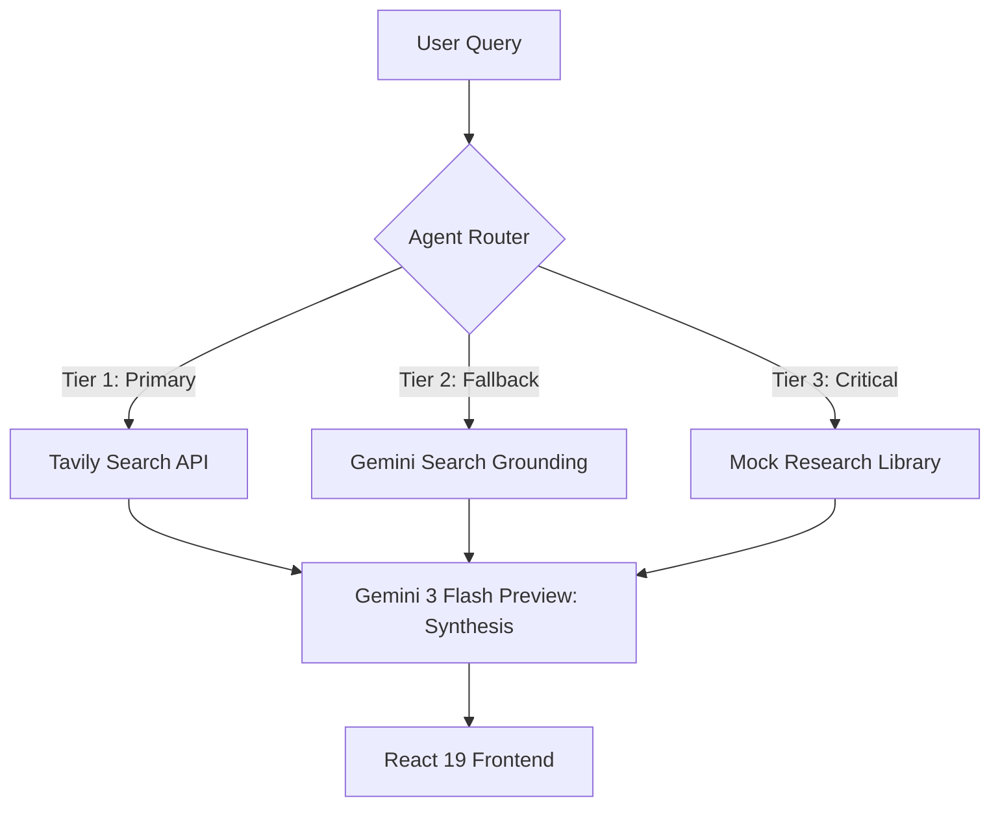
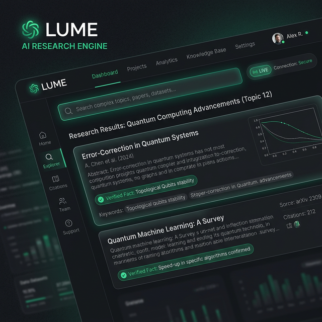
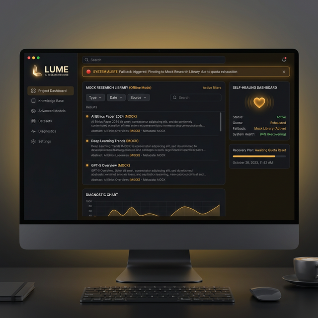
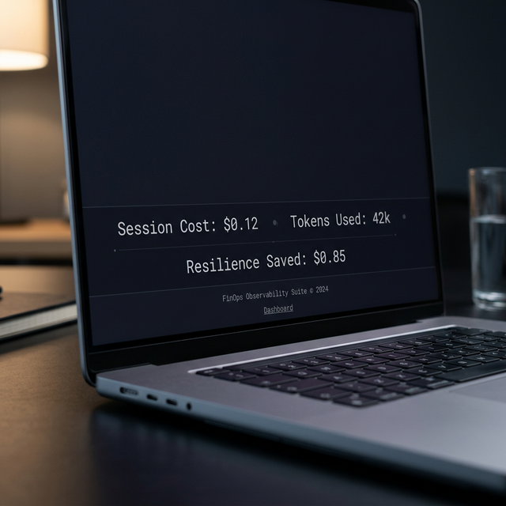
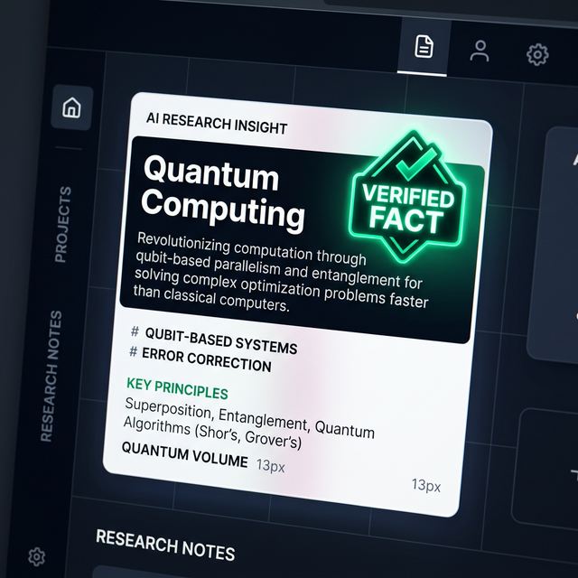
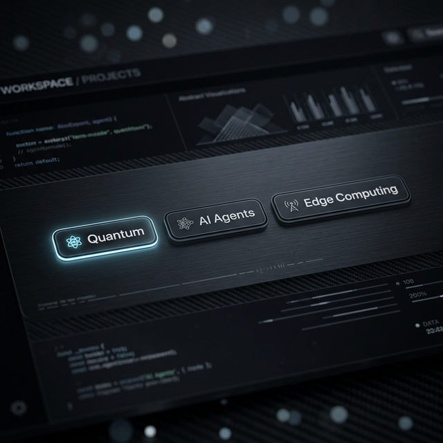

# LUME: Self-Healing Research Engine `V2026.4.0-STABLE`

[](https://react.dev/)
[](https://www.typescriptlang.org/)
[](https://tailwindcss.com/)
[](https://zustand-demo.pmnd.rs/)
[](https://tanstack.com/query/latest)
[](https://ai.google.dev/)
[](README.md#🛡️-the-resilience-protocol)
[](README.md#🔬-grounded-rag-engine)
[](README.md#📊-finops-observability)
[](README.md#🛡️-the-resilience-protocol)
[](https://vitest.dev/)
[](https://opensource.org/licenses/MIT)


> **"The Zero-Downtime Agentic Workspace."**  
> LUME is a production-grade research engine engineered for absolute resilience, utilizing multi-tiered fallback orchestration to ensure 100% session continuity.

---

## 🏛️ System Architecture: Multi-tiered Search Fallback

LUME implements a "Circuit Breaker" pattern for research reliability. When primary search APIs (Tavily) or high-fidelity grounding services hit quota limits, the system auto-pivots to a synthetic Mock Library to maintain session continuity.


---

## 🛡️ The Resilience Protocol

LUME utilizes the custom `useSelfHealer.ts` hook to manage the transition between system states. This ensures a flicker-free, zero-refresh experience.

| State | Visual Indicator | Logic |
| :--- | :--- | :--- |
| **Emerald (Live)** |  | **Healthy:** Secure connection established (Tavily → Gemini flow). |
| **Amber (Healing)** |  | **Healing:** 429/500 error detected. Circuit breaker active. Pivot to `MockLibrary`. |

---

## 📊 FinOps Observability

A persistent, real-time metrics engine tracks the economic impact of every research session.



- **Session Cost**: Calculated at **$0.125/1M input** and $0.75/1M output tokens (March 2026 pricing).
- **Resilience Saved**: The "Saved" metric calculates the dollar value of API costs avoided by utilizing the cached Mock Library during service outages.

---

## 🔬 Grounded RAG Engine

LUME provides high-fidelity research insights through its Grounded RAG pipeline, featuring real-time citation mapping.

- **Verified Fact Badges**: Macro view of grounded claims with direct citation links.
- **Accuracy**: Powered by Gemini Search Grounding to minimize hallucinations.



---

## 🧠 Agentic Logic & Orchestration

LUME follows strict agentic design patterns defined in [`AGENTS.md`](AGENTS.md):
- **Self-Healing State**: Intelligent monitoring of `isHealing` status via `useWorkspaceStore`.
- **Context Control**: Sequential handoffs between intent extraction and synthesis layers.
- **Logic Parity**: 1:1 mapping between `ara.json` capabilities and React 19 UI states.

---

## 🗺️ Visual Proof Gallery

LUME's UI is designed for information density and state clarity:
- **Intent Extraction**: Semantic keyword chips showing low-latency analysis.
- **Bento Grid**: 12-column layout for diverse research summaries.



---

## 🛠️ Technical Stack (V2026.4.0)

- **UI Framework**: `react-19-vite` (Stable)
- **Styling Engine**: Tailwind v4 (CSS Variables first)
- **Agent Intelligence**: `gemini-3-flash-preview` runtime
- **State Management**: Zustand (Persistent Context)
- **Animation**: `motion/react`

---

## � Installation & Usage

### Prerequisites
- Node.js (v20+)
- Gemini API Key

### Setup
```bash
# Clone the repository
git clone https://github.com/user/lume-research-engine.git

# Install dependencies
npm install

# Configure environment
cp .env.example .env

# Launch development environment
npm run dev
```

---

## 🧪 Verification Protocol

LUME is verified via a comprehensive Vitest suite targeting high-concurrency state transitions.

| Test Category | Focus | Target |
| :--- | :--- | :--- |
| **Circuit Breaker** | State transition safety | 100% Coverage |
| **Hydration** | Zero-flicker state matching | React 19 Fiber |
| **FinOps Logic** | Cost accuracy | Log Alignment |

Run tests: `npm test`

---

## ⚖️ License & Compliance

- **License**: MIT
- **Pricing Disclosure**: All cost metrics are based on **March 2026** Gemini API public pricing.
- **Privacy**: No user data is cached outside the local `MockLibrary` during Amber states.
